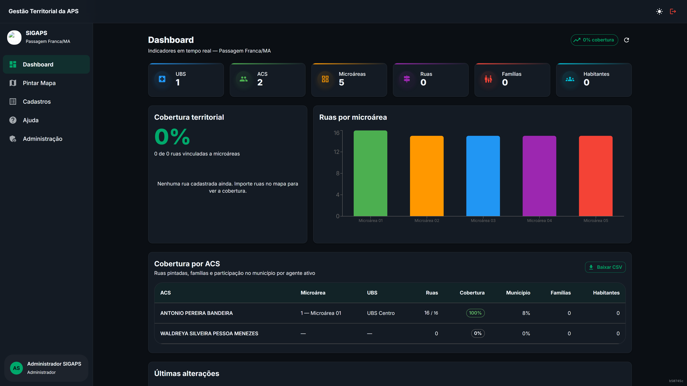

# SIGAPS — Sistema Inteligente de Gestão das Microáreas da APS

[](LICENSE)
[](LICENSE)
[](https://github.com/ymedeiros228/sigaps/actions/workflows/ci.yml)
[](https://sigaps-api.onrender.com)
[](https://sigaps-api.onrender.com/health)


GIS web open source para gestão territorial das microáreas de ACS — feito para a **Prefeitura de Passagem Franca (MA)** e preparado para **multi-município**.

**Cliente:** Jonas Almeida Medeiros — Enfermeiro responsável pelo planejamento da APS

---

## Em 60 segundos

| | |
|--|--|
| **Problema** | Microáreas da APS em papel/planilha; falta mapa, papéis e cobertura |
| **Solução** | Mapa GIS + cadastros UBS/ACS + pintura de microáreas + indicadores |
| **Stack** | React · NestJS · Prisma · PostgreSQL/**PostGIS** · Docker · PWA |
| **Demo** | [sigaps-api.onrender.com](https://sigaps-api.onrender.com) · [health](https://sigaps-api.onrender.com/health) |
| **Licença** | MIT |

### Validar a demo em 2 minutos

1. Abra a [demo](https://sigaps-api.onrender.com) (aguarde ~1 min se o Render estiver “dormindo”).
2. Confira [GET /health](https://sigaps-api.onrender.com/health) → `ok: true` (+ `commit`, `uptimeSec`).
3. Fluxo autenticado e seeds de **produção** não ficam neste README (apenas setup local/equipe).
4. Local: `docker compose up` + seed Prisma (ver Início Rápido).

### Destaques técnicos

- **Full-stack TypeScript:** React (Vite) + NestJS + Prisma + PostgreSQL/**PostGIS**
- **Mapas:** OSM/satélite, Overpass, pintura de microáreas, export PDF/GeoJSON/KML
- **Domínio de saúde:** ACS, UBS, famílias/habitantes, cobertura, pilotos CNES/e-SUS
- **Segurança:** JWT + perfis, escopo por município, rate limit, CPF mascarado (LGPD)
- **Operação:** Docker Compose, PWA, backup, keep-alive no Render, CI + Playwright smoke

## Demo ao vivo

| Link | O que é |
|------|---------|
| **[Abrir o SIGAPS](https://sigaps-api.onrender.com)** | Front + API em produção (Render) |
| [Health check](https://sigaps-api.onrender.com/health) | `ok` + commit + uptime |
| [CI no GitHub Actions](https://github.com/ymedeiros228/sigaps/actions/workflows/ci.yml) | unit + build + e2e smoke |

---

## Arquitetura (5 decisões)

| Decisão | Por quê |
|---------|--------|
| NestJS + modules | API REST modular com guards JWT/roles |
| PostGIS | Geometria real de ruas/microáreas |
| Multi-município | Escala secretarias no mesmo produto |
| JWT + escopo | Isola dados do município autenticado |
| Docker | Postgres + API + front com caminho único |

Detalhes: [docs/ARQUITETURA.md](docs/ARQUITETURA.md) · Segurança: [SECURITY.md](SECURITY.md) · Roteiro de entrevista: [docs/INTERVIEW_SIGAPS.md](docs/INTERVIEW_SIGAPS.md)

## Testes e CI

| O quê | Comando / onde |
|-------|----------------|
| Unit (backend Jest) | `cd backend && npm test` (inclui health) |
| Build frontend | `cd frontend && npm run build` |
| Playwright smoke (CI) | login + nav · `bash scripts/ci-e2e.sh` |
| Pintura mapa (local) | `cd frontend && npm run test:e2e` |

Health de produção: `/health` · `/health/db` · `/health/postgis`

---

## Para recrutadores (5 linhas)

1. **Stack:** React + NestJS + Prisma + PostgreSQL/PostGIS + Docker + PWA (MIT).  
2. **Demo:** [sigaps-api.onrender.com](https://sigaps-api.onrender.com) · badge CI verde no topo deste README.  
3. **Multi-município:** `MunicipalityScopeGuard` bloqueia cross-tenant por `municipalityId` (teste unitário em `backend/src/common/guards/municipality-scope.guard.spec.ts`).  
4. **LGPD / produção:** CPF mascarado por perfil · rate limit · `/health`, `/health/db`, `/health/postgis` · keep-alive no Render.  
5. **Defesa oral:** [docs/INTERVIEW_SIGAPS.md](docs/INTERVIEW_SIGAPS.md) · post LinkedIn: [docs/LINKEDIN_POST_SIGAPS.md](docs/LINKEDIN_POST_SIGAPS.md).

## Observabilidade (health)

| Endpoint | O que prova |
|----------|-------------|
| `GET /health` | API viva (`ok`, `commit`, `uptimeSec`, `env`) |
| `GET /health/db` | Conexão Postgres (`SELECT 1`) |
| `GET /health/postgis` | Extensão PostGIS + coluna/índice `streets.geom` |

Unit tests: `health.controller.spec.ts` + `municipality-scope.guard.spec.ts` (escopo multi-tenant).

---

## Screenshots

<p align="center">
  
</p>

<p align="center">
  
</p>

<p align="center">
  
</p>

Mais capturas no manual: [`docs/manual/screenshots/`](docs/manual/screenshots/).

## Deploy na web (gratuito)

Guia passo a passo: [docs/DEPLOY_GRATUITO.md](docs/DEPLOY_GRATUITO.md)  
Limitações para usuários: [docs/LIMITACOES_PLANO_GRATUITO.md](docs/LIMITACOES_PLANO_GRATUITO.md)

Stack sugerida: **Supabase** (banco) + **Render** (API) + **Cloudflare Pages** (site).  
Variáveis de exemplo: `.env.production.example` | Blueprint: `render.yaml`

**Produção (Sprint 4):** o frontend envia ping periódico em `/health` para reduzir cold start. No backend, `RENDER_EXTERNAL_URL` ativa keep-alive automático; `AUTO_BACKUP_ENABLED=false` desliga o cron semanal. Backups automáticos ficam em `uploads/backups/` (disco efêmero no Render gratuito — baixe via Administração).

---
| Documento | Descrição |
|-----------|-----------|
| [Documentação Completa (PDF)](docs/SIGAPS_Documentacao_Completa.pdf) | Manual detalhado do projeto |
| [Análise da Proposta](docs/ANALISE_PROPOSTA.md) | Conformidade proposta vs. implementação |
| [Arquitetura](docs/ARQUITETURA.md) | Diagramas e decisões técnicas |
| [Roadmap](docs/ROADMAP.md) | Fases de desenvolvimento |
| [API REST](docs/API.md) | Referência de endpoints |
| [Swagger](http://localhost:3000/docs) | Documentação interativa (com API rodando) |
| [Roteiro entrevista (10 Q&A)](docs/INTERVIEW_SIGAPS.md) | Defesa oral do projeto |
| [Rascunho post LinkedIn](docs/LINKEDIN_POST_SIGAPS.md) | Narrativa problema → decisão → resultado |

---

## Stack (100% Open Source)

| Camada | Tecnologias |
|--------|-------------|
| Frontend | React, TypeScript, Vite, Material UI, React Leaflet, Zustand, TanStack Query |
| Backend | NestJS, Prisma, JWT, Swagger |
| Banco | PostgreSQL + PostGIS |
| Mapas | OpenStreetMap, Nominatim, Overpass API, Esri World Imagery |
| Infra | Docker, Docker Compose, Nginx |

---

## Funcionalidades

- Autenticação JWT com perfis (Administrador, Secretário, Coordenador, Enfermeiro, ACS) e refresh automático
- **Multi-município** — troca de contexto na UI para escalar além de Passagem Franca/MA
- Dashboard com indicadores, gráficos, cobertura territorial, relatório **cobertura por ACS** e histórico de alterações
- Mapa interativo com camadas OSM, satélite e relevo
- Importação de ruas via OpenStreetMap (Overpass API) e enriquecimento com bairro quando disponível
- Vinculação de ruas a microáreas e bairros (individual, seleção múltipla, import CSV/GeoJSON)
- Modo **Pintar Microárea** (pincel), borracha, zonas circulares e conflito 1 rua = 1 microárea
- Cadastros CRUD: UBS, bairros, ACS (manual + CSV + foto), microáreas com vínculo ACS/UBS/bairro
- Famílias e habitantes por rua (edição manual + import CSV piloto e-SUS)
- Exportação: PDF oficial A4/A3, PNG/JPEG, GeoJSON, KML, SVG e planilhas CSV
- Mapa de calor por densidade de famílias
- Marcadores de UBS no mapa
- **PWA** — instalável no celular, cache offline para ACS em campo
- Integrações piloto: consulta **CNES** e importação CSV **e-SUS**
- Administração: CRUD de usuários, backup manual/automático, auditoria paginada
- LGPD: CPF mascarado na API conforme perfil
- API documentada via Swagger
- **Segurança:** escopo por município, rate limiting, SQL parametrizado, CPF mascarado em auditoria

Detalhamento e próximos passos: [ROADMAP.md](docs/ROADMAP.md)

---

## Estrutura do Projeto

```
sigaps/
├── backend/          # NestJS API
├── frontend/         # React SPA
├── docs/             # Documentação + PDF
├── scripts/          # Utilitários
├── nginx/            # Reverse proxy
├── docker-compose.yml
└── README.md
```

---

## Início Rápido

### Pré-requisitos

- Node.js 20+
- Docker e Docker Compose (recomendado)

### 1. Configurar

```bash
cd sigaps
cp .env.example .env
```

### 2. Banco (Docker)

```bash
docker compose up postgres -d
```

### 3. Backend

```bash
cd backend
npm install
npx prisma generate
npx prisma migrate deploy
npm run prisma:seed
npm run start:dev
```

API: http://localhost:3000 · Swagger: http://localhost:3000/docs

### 4. Frontend

```bash
cd frontend
npm install
npm run dev
```

App: http://localhost:5173

### Testes E2E (Playwright)

Com Postgres rodando (`docker compose up postgres -d`):

```bash
bash scripts/ci-e2e.sh
```

Ou manualmente: backend em `:3000`, `npm run build && npm run preview` no frontend, depois `cd frontend && npm run test:e2e`.

### Lint

- Backend: `npm run lint` **apenas verifica** (não altera arquivos); use `npm run lint:fix` para corrigir automaticamente.
- Frontend: `npm run lint` (Oxlint).

> O backend carrega variáveis do `backend/.env` ou, na ausência dele, do `.env` da raiz — então o `cp .env.example .env` na raiz já é suficiente para rodar a partir de `backend/`.

### 5. Produção

```bash
docker compose up -d --build
```

Acesse: http://localhost

### Gerar PDF da documentação

```bash
npm install
npm run docs:pdf
```

---

## Credenciais padrão (seed)

> **Atenção:** as credenciais de seed ficam apenas no setup local (`.env` / seed do Prisma).  
> **Não use e-mails ou senhas de exemplo em produção.** Após o primeiro login em ambiente real, troque a senha do administrador.

Consulte `.env.example` e o seed do backend para o usuário demo local.


## Fluxo principal

1. Faça login no sistema
2. Acesse **Mapa** → clique em **Importar Ruas OSM**
3. Pesquise uma rua ou clique diretamente nela
4. Vincule à microárea desejada — a rua será pintada automaticamente
5. Use **Pintar Microárea** para modo pincel contínuo
6. Use **Ctrl+clique** para selecionar várias ruas de uma vez

---

## Licença

[MIT](LICENSE) — Código aberto para uso e replicação em municípios brasileiros.

---

Desenvolvido para a **Secretaria Municipal de Saúde de Passagem Franca - Maranhão**.
