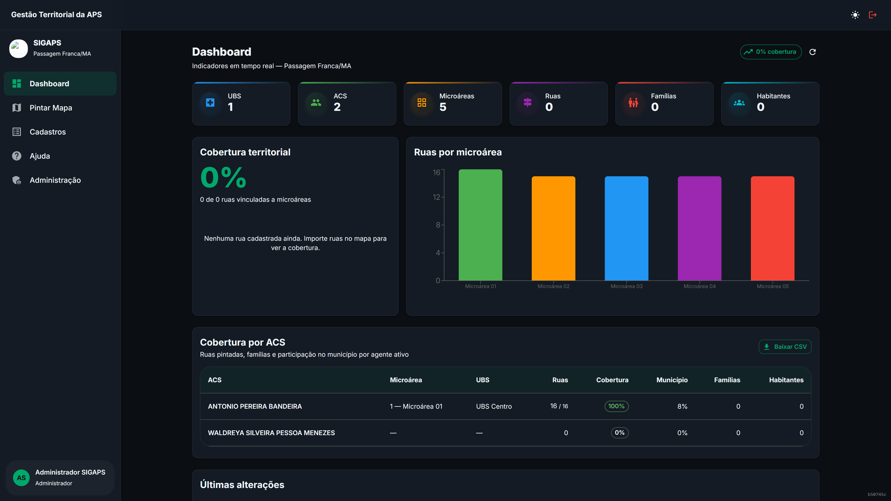
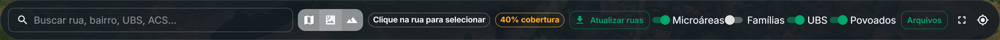
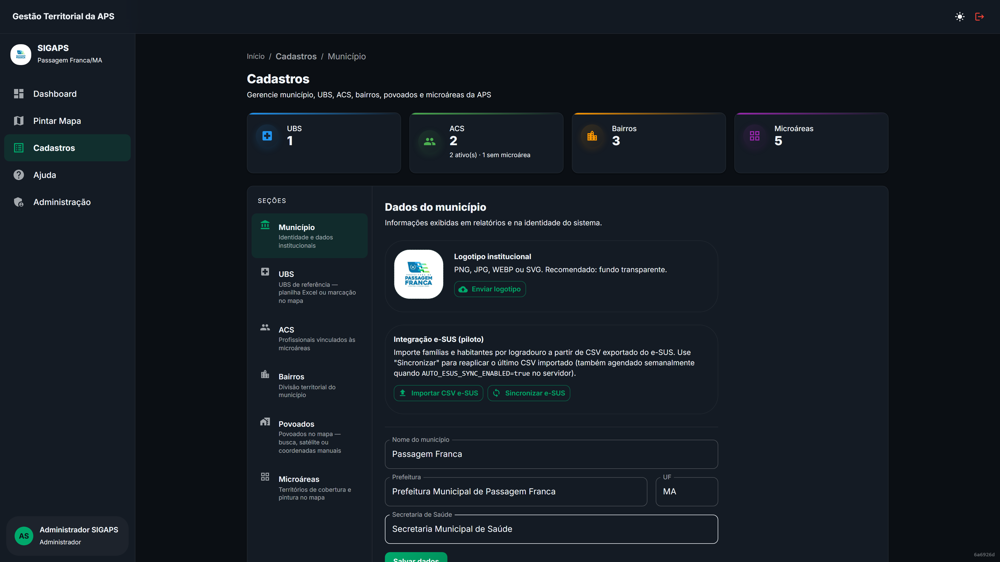
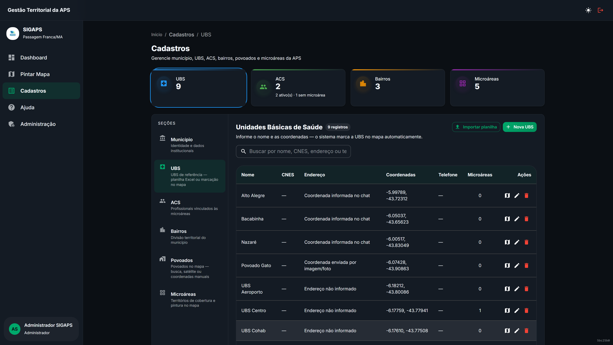
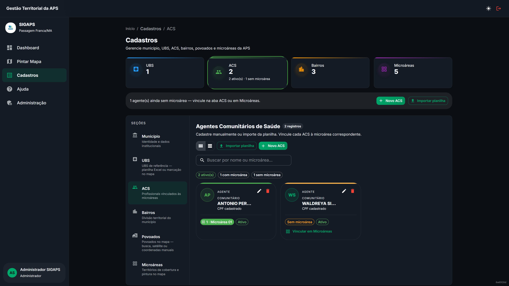
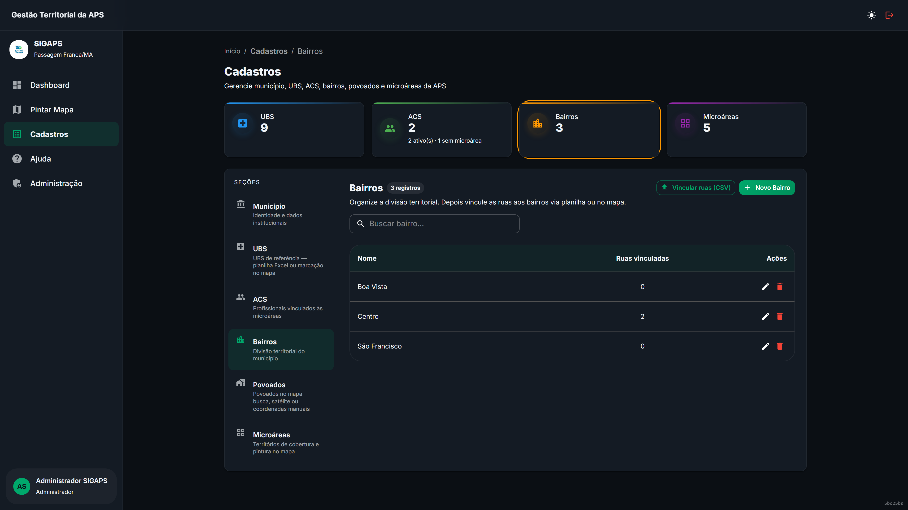
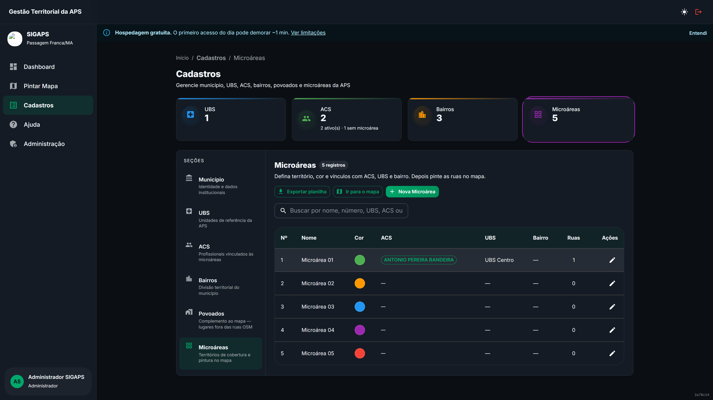
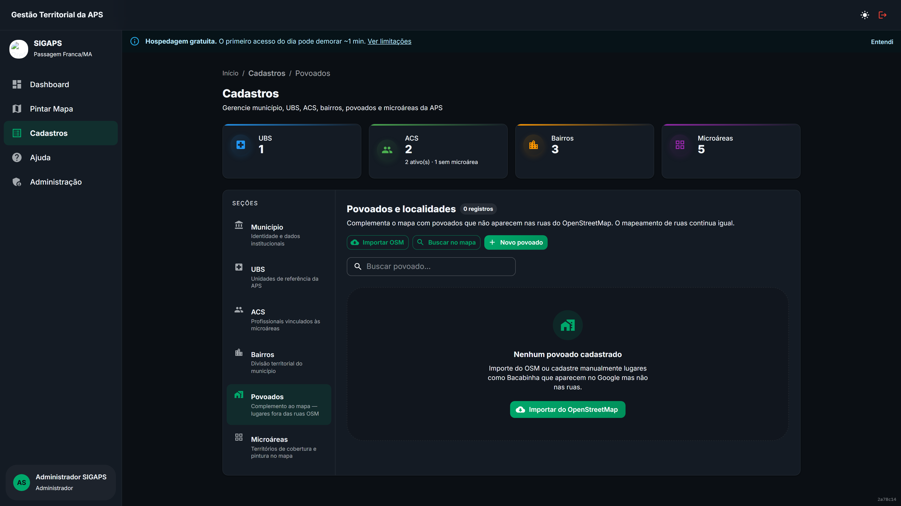
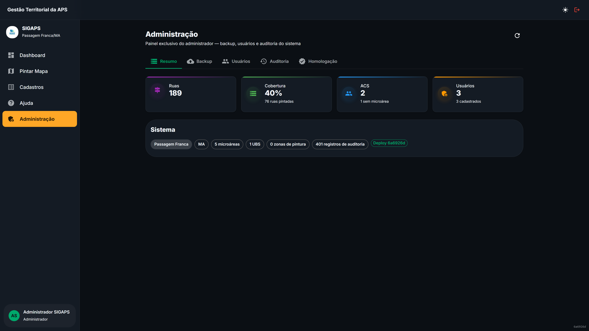
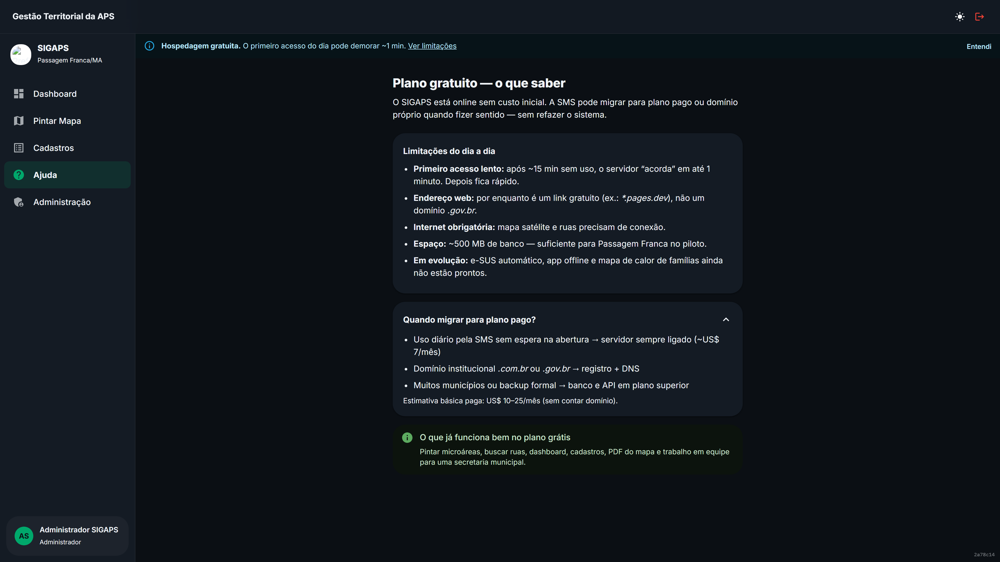

## Sumário

1. [Apresentação e objetivo](#1-apresentação-e-objetivo)
2. [Escopo da entrega](#2-escopo-da-entrega)
3. [Acesso ao sistema](#3-acesso-ao-sistema)
4. [Perfis de usuário e permissões](#4-perfis-de-usuário-e-permissões)
5. [Dashboard — indicadores em tempo real](#5-dashboard--indicadores-em-tempo-real)
6. [Mapa interativo — pintura territorial](#6-mapa-interativo--pintura-territorial)
7. [Cadastros — gestão da APS](#7-cadastros--gestão-da-aps)
8. [Povoados e localidades (complemento ao mapa)](#8-povoados-e-localidades)
9. [Integrações e importações](#9-integrações-e-importações)
10. [Administração do sistema](#10-administração-do-sistema)
11. [Como usar no dia a dia (Enfermeiro APS)](#11-como-usar-no-dia-a-dia-enfermeiro-aps)
12. [Segurança, auditoria e LGPD](#12-segurança-auditoria-e-lgpd)
13. [Arquitetura técnica](#13-arquitetura-técnica)
14. [Suporte e limitações do ambiente](#14-suporte-e-limitações-do-ambiente)
15. [Termo de aceite e assinaturas](#15-termo-de-aceite-e-assinaturas)

**Este documento constitui o Manual Técnico e o Contrato de Entrega e Aceite** entre o desenvolvedor **Yuri Medeiros Bandeira** e o cliente **Jonas Almeida Medeiros** (Enfermeiro da APS), referente ao sistema SIGAPS implantado em produção no município de Passagem Franca/MA.

---

# 1. Apresentação e objetivo

## 1.1 Contexto

A **Atenção Primária à Saúde (APS)** no Brasil organiza o território em **microáreas**, cada uma coberta por um **Agente Comunitário de Saúde (ACS)**. O planejamento territorial exige mapas precisos que relacionem ruas, bairros, povoados e equipes — tarefa tradicionalmente feita em planilhas ou desenhos imprecisos.

O **SIGAPS** (*Sistema Inteligente de Gestão das Microáreas da APS*) resolve esse problema com uma plataforma GIS web profissional: o enfermeiro, coordenador ou secretário trabalha diretamente sobre o **mapa real do município**, vinculando ruas oficiais (OpenStreetMap) às microáreas com cores automáticas, indicadores de cobertura e relatórios exportáveis.

## 1.2 Destinatário deste manual

Este documento foi elaborado para **Jonas Almeida Medeiros**, enfermeiro da APS em Passagem Franca/MA, como referência completa do sistema entregue. Contém descrição funcional, capturas de tela da aplicação em produção, fluxos de trabalho e termo de aceite para homologação oficial.

## 1.3 Objetivos do sistema

| Objetivo | Descrição |
|----------|-----------|
| **Territorialização** | Vincular cada rua do município a uma microárea no mapa |
| **Visualização** | Exibir cobertura por cores, gráficos e indicadores |
| **Cadastro APS** | Gerenciar UBS, ACS, bairros, povoados e microáreas |
| **Integração** | Importar dados do OSM, e-SUS (CSV) e CNES |
| **Rastreabilidade** | Registrar todas as alterações em log de auditoria |
| **Relatórios** | Exportar mapas em PDF, PNG, GeoJSON, KML e CSV |

---

# 2. Escopo da entrega

## 2.1 Módulos entregues

| Módulo | Status | Descrição |
|--------|--------|-----------|
| Autenticação JWT | ✅ Entregue | Login seguro com refresh automático |
| Dashboard | ✅ Entregue | Indicadores, gráficos, checklist operacional |
| Mapa interativo | ✅ Entregue | Pintura, busca, camadas, exportação |
| Cadastros | ✅ Entregue | Município, UBS, ACS, Bairros, Povoados, Microáreas |
| Integrações OSM | ✅ Entregue | Importação de ruas e povoados |
| Integração e-SUS | ✅ Entregue | Importação CSV de famílias/habitantes |
| Integração CNES | ✅ Entregue | Validação de UBS no Ministério da Saúde |
| Administração | ✅ Entregue | Usuários, backup, auditoria, homologação |
| PWA (celular) | ✅ Entregue | Instalável como aplicativo no smartphone |
| Modo ACS | ✅ Entregue | Consulta restrita à microárea do agente |

## 2.2 Fora do escopo (evolução futura)

- Sincronização automática bidirecional com e-SUS AB (atualmente via CSV)
- Aplicativo nativo iOS/Android
- Módulo de visitas domiciliares em campo

---

# 3. Acesso ao sistema

## 3.1 URL e requisitos

| Item | Valor |
|------|-------|
| **Endereço** | https://sigaps-api.onrender.com |
| **Navegador** | Chrome, Edge ou Firefox (versão atual) |
| **Internet** | Conexão estável (mapas consomem dados) |
| **Dispositivo** | Computador, tablet ou celular (PWA) |

## 3.2 Tela de login

A tela de login apresenta a identidade visual do município, campos de e-mail e senha, e aviso sobre o tempo de resposta na hospedagem gratuita (primeiro acesso do dia pode levar até 1 minuto).

Figura 1 — Tela de login do SIGAPS (Passagem Franca/MA)

## 3.3 Credenciais de demonstração

| Perfil | E-mail | Senha | Uso |
|--------|--------|-------|-----|
| Administrador | admin@passagemfranca.ma.gov.br | Sigaps@2026 | Gestão completa |
| Enfermeiro | jonas@passagemfranca.ma.gov.br | Sigaps@2026 | Operação diária |
| ACS | acs@passagemfranca.ma.gov.br | Sigaps@2026 | Consulta microárea |

**Importante:** Altere as senhas padrão após a homologação oficial. O administrador pode redefinir senhas em **Administração → Usuários**.

---

# 4. Perfis de usuário e permissões

O SIGAPS possui cinco perfis de acesso, cada um com permissões específicas:

| Capacidade | Admin | Sec. Saúde | Coord. APS | Enfermeiro | ACS |
|------------|:-----:|:----------:|:----------:|:----------:|:---:|
| Dashboard | ✓ | ✓ | ✓ | ✓ | — |
| Mapa (consulta) | ✓ | ✓ | ✓ | ✓ | ✓* |
| Pintar / importar ruas | ✓ | ✓ | ✓ | ✓ | — |
| Cadastros (editar) | ✓ | ✓ | ✓ | —** | — |
| Cadastrar ACS | ✓ | ✓ | ✓ | ✓ | — |
| Administração | ✓ | — | — | — | — |
| Homologar mapa | ✓ | ✓ | — | — | — |

\* ACS visualiza apenas a microárea vinculada ao seu cadastro.  
\** Enfermeiro edita somente a seção ACS; demais seções em modo leitura.

---

# 5. Dashboard — indicadores em tempo real

O Dashboard é a página inicial do sistema (exceto para ACS, que são direcionados ao mapa). Apresenta uma visão consolidada da situação territorial do município.

Figura 2 — Checklist operacional, indicadores, cobertura territorial e tabela por ACS

## 5.1 Indicadores principais

| Card | O que mostra |
|------|--------------|
| **UBS** | Total de Unidades Básicas de Saúde cadastradas |
| **ACS** | Agentes comunitários ativos |
| **Microáreas** | Territórios de cobertura definidos |
| **Ruas** | Vias importadas do OpenStreetMap |
| **Famílias** | Total de famílias (dados e-SUS) |
| **Habitantes** | População estimada por rua |

## 5.2 Cobertura territorial

Exibe o percentual de ruas já vinculadas a microáreas. A meta operacional recomendada é **≥ 80%** para homologação do mapa pela Secretaria Municipal de Saúde.

## 5.3 Gráficos e tabelas

- **Gráfico de pizza:** ruas vinculadas vs. pendentes
- **Gráfico de barras:** distribuição de ruas por microárea (cores correspondentes ao mapa)
- **Tabela de cobertura por ACS:** ruas pintadas, percentual, famílias e habitantes por agente
- **Exportação CSV** da tabela de cobertura

## 5.4 Checklist operacional

Lista de 9 itens que acompanham a implantação:

1. Malha viária importada
2. Microáreas cadastradas
3. UBS cadastradas
4. ACS vinculados às microáreas
5. Cobertura territorial ≥ 80% — **pós-entrega** (Jonas pinta no mapa)
6. Bairros atribuídos às ruas (≥ 50%)
7. Dados de famílias (e-SUS) — **opcional**
8. Sincronização e-SUS — **opcional**
9. Mapa homologado pela SMS — **pós-pintura**

O percentual do checklist mede só a **entrega do software** (itens 1–4 e 6). Itens 5, 7, 8 e 9 não reduzem esse número.

## 5.5 Próximos passos (painel guia)

No topo do Dashboard, o painel **Próximos passos** orienta o fluxo do dia a dia:

| Situação | O que o sistema sugere |
|----------|------------------------|
| Cadastros incompletos | Ir para Cadastros e concluir ACS, microáreas ou UBS |
| Mapa zerado, dados prontos | Abrir o mapa e começar a pintura territorial |
| Cobertura abaixo de 80% | Continuar pintando com barra de progresso |
| Famílias importadas + pintura | Ver mapa de calor (`/mapa?heatmap=1`) |
| Sem dados e-SUS | Opcional — importar em Cadastros → Município quando quiser calor no mapa |
| Pronto para homologação | Guia em Administração → Homologação |

<strong>Entrega Passagem Franca:</strong> o sistema pode ser entregue com <strong>mapa zerado</strong> (ruas cinza, sem microárea pintada). Os cadastros (UBS, ACS, microáreas, malha viária) já vêm prontos; a <strong>decisão de quem pinta o quê</strong> é do enfermeiro no mapa.

---

# 6. Mapa interativo — pintura territorial

O módulo **Pintar Mapa** é o coração do SIGAPS. Sobre o mapa real do município, cada rua recebe a **cor da microárea** a que pertence, facilitando a visualização da cobertura territorial.

As capturas desta seção podem mostrar ruas já coloridas para ilustrar o manual. Na **entrega operacional**, o mapa pode estar **zerado** (ruas cinza) para você pintar do zero com os cadastros já prontos.

Figura 3 — Mapa OpenStreetMap com ruas coloridas por microárea, UBS (azul) e povoados (marrom)

Figuras 4 e 5 — Painel de pintura: escolha da microárea, modos Pintar/Apagar e botão Guardar

## 6.1 O que aparece no mapa

| Elemento | Cor / ícone | Significado |
|----------|-------------|-------------|
| **Ruas pintadas** | Verde, laranja, azul, roxo, vermelho… | Vinculadas a uma microárea (com contorno branco para destaque) |
| **Ruas cinza** | Linha tracejada | Sem microárea — prontas para você pintar |
| **Calor de famílias** | Tons quentes sobre a pintura | Densidade e-SUS por logradouro (toggle **Famílias**) |
| **UBS** | Marcador azul | Unidade Básica de Saúde (9 unidades cadastradas) |
| **Povoados** | Marcador marrom | Localidades rurais complementares |
| **Legenda** | Canto inferior esquerdo | Contagem por microárea e % de cobertura |

## 6.2 Barra de ferramentas

| Ferramenta | Função |
|------------|--------|
| **Busca** | Localizar ruas, bairros, UBS, ACS, microáreas e povoados |
| **Camadas** | Mapa de ruas (OpenStreetMap), Satélite ou Relevo |
| **Cobertura %** | Percentual de ruas já pintadas |
| **Toggles** | Envelopes das microáreas, UBS, Povoados e **Famílias** (mapa de calor) |
| **Arquivos** | Importar/exportar GeoJSON, KML, CSV, PDF |
| **Centralizar** | Voltar ao centro do município |

## 6.3 Como pintar (passo a passo)

1. Abra o painel **Pintar microáreas** (parte inferior da tela)
2. Escolha a **cor do ACS** (microárea) — o modo pintar inicia automaticamente
3. Modo padrão **Arrastar**: clique num ponto da rua e **arraste** ao longo do traço; solte para salvar
4. Outros modos no painel: **Rua inteira** (um clique), **Lado E / Lado D** (só um lado da via)
5. **Opções avançadas** → **Dividir trecho** (clique em pontos para cortar — use só se precisar)
6. Clique em **Guardar** para minimizar o painel e conferir o resultado

**Atalhos de teclado:** **P** pintar · **E** apagar · **S** ou **Esc** sair do modo pintar

**Apagar:** botão **Apagar** no painel (ou tecla **E**); arraste na rua colorida para remover trecho (modo brush). Ruas cinza ainda não têm microárea — pinte antes de apagar.

**Mover o mapa:** botão **Mover** no painel (evita pintar enquanto arrasta o mapa).

## 6.4 Exportações do mapa

| Formato | Uso |
|---------|-----|
| **PDF A4/A3** | Mapa oficial para impressão (com carimbo de homologação) |
| **PNG / JPEG** | Apresentações e reuniões |
| **GeoJSON / KML** | QGIS e Google Earth |

---

# 7. Cadastros — gestão da APS

A seção **Cadastros** centraliza todos os dados estruturais da APS. Acesso pelo menu lateral ou URL `/cadastros?secao={seção}`.

## 7.1 Município

Figura 6 — Dados institucionais, logotipo e importação e-SUS

- Nome, UF, prefeitura e secretaria
- Upload do logotipo municipal (aparece no login e relatórios)
- **Importar CSV e-SUS** (famílias e habitantes por rua)
- **Re-sincronizar** último arquivo importado

## 7.2 Unidades Básicas de Saúde (UBS)

Figura 7 — Cadastro de UBS com validação CNES (9 unidades: 5 urbanas e 4 rurais)

- Nome, endereço, telefone, coordenadas e coordenador
- **Validação CNES** via API do Ministério da Saúde
- Marcador azul no mapa (toggle UBS)
- Unidades urbanas: Mutirão, Centro, Aeroporto, Faveira e Cohab
- Unidades rurais: Alto Alegre, Bacabinha, Nazaré e Povoado Gato

## 7.3 Agentes Comunitários de Saúde (ACS)

Figura 8 — Gestão de ACS com vinculação a microáreas

- Visualização em cards ou tabela
- Cadastro manual ou **importação em lote CSV**
- Vinculação obrigatória à microárea
- Foto do agente (opcional)
- Filtro "sem microárea" para pendências

## 7.4 Bairros

Figura 9 — Divisão territorial e vinculação de ruas

- CRUD de bairros do município
- **Vincular ruas via planilha CSV** (modelo disponível no sistema)
- Contagem de ruas por bairro

## 7.5 Microáreas

Figura 10 — Territórios de cobertura com cores e vínculos

- Número, nome, cor e descrição
- Vínculos: UBS, ACS e bairro de referência
- Contagem de ruas pintadas
- Atalhos para pintar no mapa

---

# 8. Povoados e localidades

Módulo criado para **complementar** o mapa de ruas do OpenStreetMap com lugares que aparecem no Google Maps mas não constam na malha viária — como o **Povoado Bacabinha**.

Figura 11 — Cadastro de povoados e localidades rurais

## 8.1 Funcionalidades

| Ação | Descrição |
|------|-----------|
| **Importar OSM** | Busca povoados, vilas e localidades no OpenStreetMap |
| **Buscar no mapa** | Geocodificação via Nominatim (estilo Google Maps) |
| **Cadastro manual** | Nome, tipo, latitude e longitude |
| **Marcadores no mapa** | Ícones marrons (toggle "Povoados" na barra do mapa) |
| **Busca unificada** | Povoados aparecem na barra de pesquisa do mapa |

## 8.2 Tipos de localidade

- **Povoado** — núcleo rural habitado
- **Localidade** — lugar nomeado sem classificação específica
- **Distrito** — subdivisão administrativa

## 8.3 Cadastro manual com coordenadas

Quando a busca automática (OSM ou Nominatim) **não encontra** o lugar — mas ele aparece no Google Maps — use o cadastro manual:

<strong>Passo 1.</strong> Cadastros → <strong>Povoados</strong> → <strong>Cadastrar com coordenadas</strong> (ou botão <strong>Novo</strong>). 
<strong>Passo 2.</strong> Informe o <strong>nome</strong> e o <strong>tipo</strong> (povoado, localidade ou distrito). 
<strong>Passo 3.</strong> No mapa satélite do formulário, <strong>clique no ponto exato</strong> ou arraste o pino azul para ajustar. 
<strong>Passo 4.</strong> Alternativa: no Google Maps, clique com o botão direito no local → <strong>Copiar coordenadas</strong> → cole no campo <strong>Colar coordenadas</strong> do SIGAPS. 
<strong>Passo 5.</strong> Clique em <strong>Cadastrar e marcar no mapa</strong>. O marcador marrom aparece imediatamente no mapa principal (ative o toggle <strong>Povoados</strong>).

<strong>Dica:</strong> Se a busca Nominatim não retornar resultados, o sistema oferece o atalho <strong>Cadastrar com coordenadas</strong> na mesma tela — não é necessário sair do cadastro.

O mapeamento de **ruas** existente **não é alterado** por este módulo. Os povoados são pontos complementares exibidos como marcadores no mapa.

---

# 9. Integrações e importações

## 9.1 OpenStreetMap / Overpass

| O quê | Onde | Como |
|-------|------|------|
| Ruas | Mapa → Atualizar ruas | API Overpass (automático) |
| Povoados | Cadastros → Povoados → Importar OSM | Complemento após import de ruas |

## 9.2 e-SUS (CSV piloto)

1. Exportar planilha do e-SUS com famílias por logradouro
2. Cadastros → Município → Importar CSV e-SUS (modelo e erros por linha no diálogo)
3. Opcional: **Sincronizar e-SUS** para reprocessar o último arquivo
4. No mapa, toggle **Famílias** — calor sobreposto à pintura (não substitui cores das microáreas)
5. Indicadores no Dashboard e checklist operacional

## 9.3 CNES (Ministério da Saúde)

Cadastros → UBS → informar código CNES → sistema valida e preenche dados automaticamente.

## 9.4 Formatos geográficos

| Formato | Importar | Exportar |
|---------|:--------:|:--------:|
| GeoJSON | ✓ | ✓ |
| KML | ✓ | ✓ |
| CSV (ruas) | ✓ | — |
| Shapefile (.shp) | ✓ | — |
| PDF / PNG | — | ✓ |

---

# 10. Administração do sistema

Acesso exclusivo do **Administrador** em `/admin`.

Figura 12 — Painel administrativo

## 10.1 Abas disponíveis

| Aba | Função |
|-----|--------|
| **Resumo** | Contagens do sistema, versão e commit |
| **Backup** | Exportar/importar JSON; backups automáticos semanais |
| **Usuários** | Criar, editar, ativar/desativar, redefinir senha |
| **Auditoria** | Log de todas as ações com filtros e export CSV |
| **Homologação** | Registrar mapa oficial SMS; certificado PDF |

## 10.2 Homologação do mapa

Quando o checklist operacional estiver completo (cobertura ≥ 80%):

1. Admin → Homologação → Registrar com observações
2. Carimbo aparece nos PDFs exportados do mapa
3. Certificado PDF disponível para arquivo oficial

---

# 11. Como usar no dia a dia (Enfermeiro APS)

Esta seção descreve o **uso prático** do SIGAPS pelo enfermeiro da APS — como **Jonas Almeida Medeiros** utilizará o sistema no cotidiano da secretaria. Não é um roteiro de implantação técnica (isso fica com o administrador), e sim o passo a passo do trabalho territorial.

## 11.1 Entrar e ver a situação do município

<strong>Passo 1.</strong> Acesse https://sigaps-api.onrender.com e faça login com seu e-mail e senha. 
<strong>Passo 2.</strong> No <strong>Dashboard</strong>, verifique o percentual de <strong>cobertura territorial</strong> e quantos ACS ainda estão sem microárea. 
<strong>Passo 3.</strong> Confira o <strong>Checklist operacional</strong> no topo do Dashboard (Figura 2) para ver o que ainda falta concluir.

## 11.2 Pintar ruas no mapa (tarefa principal)

<strong>Passo 1.</strong> Menu lateral → <strong>Pintar Mapa</strong>. 
<strong>Passo 2.</strong> No painel inferior <strong>Pintar microáreas</strong>, toque na <strong>cor do ACS</strong> desejada — o modo pintar inicia automaticamente. 
<strong>Passo 3.</strong> Modo padrão <strong>Arrastar</strong>: clique e arraste ao longo da rua; solte para salvar. Alternativas no painel: 
&nbsp;&nbsp;• <strong>Rua inteira</strong> — um clique colorirá a via toda. 
&nbsp;&nbsp;• <strong>Lado E / Lado D</strong> — para avenidas, pinta só o lado escolhido. 
&nbsp;&nbsp;• <strong>Dividir trecho</strong> (avançado) — cada clique corta a rua num ponto. 
<strong>Passo 4.</strong> Use <strong>Mover</strong> no painel para arrastar o mapa sem pintar. 
<strong>Passo 5.</strong> Para pintar várias ruas de uma vez, expanda <strong>Mais opções</strong> → <strong>Pintar bairro inteiro</strong> (quando as ruas já tiverem bairro cadastrado). 
<strong>Passo 6.</strong> Ao terminar, clique em <strong>Guardar</strong> para minimizar o painel e conferir o resultado. 
<strong>Dica:</strong> Use a <strong>busca</strong> no topo para localizar uma rua pelo nome antes de pintar. Atalhos: <strong>P</strong> pintar · <strong>E</strong> apagar · <strong>S</strong> ou <strong>Esc</strong> sair.

## 11.3 Cadastrar ou atualizar ACS

<strong>Passo 1.</strong> Menu → <strong>Cadastros</strong> → seção <strong>ACS</strong>. 
<strong>Passo 2.</strong> Clique em <strong>Novo ACS</strong> ou edite um existente. 
<strong>Passo 3.</strong> Preencha nome e vincule à <strong>microárea</strong> correspondente. 
<strong>Passo 4.</strong> Use o filtro <strong>"sem microárea"</strong> para encontrar agentes pendentes de vínculo.

## 11.4 Complementar povoados no mapa

Quando um lugar aparece no Google Maps mas não nas ruas do sistema (ex.: Povoado Bacabinha):

<strong>Passo 1.</strong> Cadastros → <strong>Povoados</strong> → tente <strong>Importar OSM</strong> ou <strong>Buscar no mapa</strong> (Nominatim). 
<strong>Passo 2.</strong> Se a busca não retornar resultados, clique em <strong>Cadastrar com coordenadas</strong>. 
<strong>Passo 3.</strong> No formulário, clique no mapa satélite no ponto exato <strong>ou</strong> cole as coordenadas copiadas do Google Maps. 
<strong>Passo 4.</strong> Salve com <strong>Cadastrar e marcar no mapa</strong>. 
<strong>Passo 5.</strong> No mapa principal, ative o toggle <strong>Povoados</strong> na barra superior para ver o marcador marrom. 
<strong>Passo 6.</strong> Use a busca do mapa para localizar o povoado pelo nome e conferir a posição.

## 11.5 Exportar mapa para reunião ou arquivo

<strong>Passo 1.</strong> No mapa, clique em <strong>Arquivos</strong> (menu de exportação). 
<strong>Passo 2.</strong> Escolha <strong>PDF A4</strong> para impressão oficial ou <strong>PNG</strong> para apresentação. 
<strong>Passo 3.</strong> Se o mapa estiver homologado pela SMS, o carimbo aparece automaticamente no PDF.

## 11.6 Acompanhar cobertura após pintar

Após cada sessão de pintura, volte ao **Dashboard** e confira se o percentual de cobertura subiu. A meta para homologação é **≥ 80%** das ruas vinculadas a microáreas.

## 11.7 Importar famílias (e-SUS) e mapa de calor

<strong>Passo 1.</strong> Cadastros → <strong>Município</strong> → <strong>Importar CSV e-SUS</strong> (modelo disponível no diálogo). 
<strong>Passo 2.</strong> Revise erros por linha, se houver; confirme o import. 
<strong>Passo 3.</strong> Opcional: <strong>Sincronizar e-SUS</strong> para reprocessar o último arquivo. 
<strong>Passo 4.</strong> No mapa, ative o toggle <strong>Famílias</strong> na barra superior — o calor aparece <strong>sobre</strong> as cores das microáreas (não substitui a pintura). 
<strong>Atalho:</strong> link direto <code>/mapa?heatmap=1</code> ou botão no Dashboard quando há famílias e pintura.

## 11.8 Homologação do mapa com a SMS

Quando a cobertura e o checklist estiverem prontos:

<strong>Passo 1.</strong> Dashboard → confira alerta <strong>Pronto para homologação</strong>. 
<strong>Passo 2.</strong> Administração → <strong>Homologação</strong> → wizard em 3 passos (checklist → PDF → registrar aceite). 
<strong>Passo 3.</strong> No mapa, exporte <strong>PDF A3</strong> (menu Arquivos). Use <code>/mapa?pdf=1&homolog=1</code> para abrir com dica de revisão. 
<strong>Passo 4.</strong> Leve o PDF à reunião da SMS; após o aceite, registre em Admin → Homologação com observações. 
<strong>Passo 5.</strong> Os próximos PDFs exportados exibirão o carimbo de homologação.

---

# 12. Segurança, auditoria e LGPD

## 12.1 Autenticação

- JWT com access token (15 min) e refresh token (7 dias)
- Senhas armazenadas com hash bcrypt
- Sessão persistida com renovação automática

## 12.2 Auditoria

Todas as ações relevantes são registradas:

- Cadastro, edição e exclusão de entidades
- Pintura e desvinculação de ruas
- Importações OSM e e-SUS
- Homologação/revogação do mapa
- Reset de senha

Consulta em **Administração → Auditoria** com export CSV.

## 12.3 LGPD — proteção de dados pessoais

- CPF exibido completo apenas para Administrador, Secretário e Coordenador
- Enfermeiro e ACS visualizam CPF mascarado (***.***.***-XX)
- Logs de auditoria não armazenam senhas

---

# 13. Arquitetura técnica

| Camada | Tecnologia |
|--------|------------|
| **Frontend** | React 19, TypeScript, Vite, Material UI, Leaflet |
| **Estado** | Zustand + TanStack Query |
| **Backend** | NestJS, Prisma ORM, Swagger |
| **Banco** | PostgreSQL + PostGIS (Supabase) |
| **Mapas** | OpenStreetMap (padrão), Esri Satélite, OpenTopoMap |
| **Geocodificação** | Nominatim, Overpass API |
| **Hospedagem** | Render (API) + GitHub Actions (CI/CD) |
| **PWA** | Service Worker + manifest (instalável) |

## 13.1 Repositório

Código-fonte open source (licença MIT): [github.com/ymedeiros228/sigaps](https://github.com/ymedeiros228/sigaps)

---

# 14. Suporte e limitações do ambiente

Figura 13 — Orientações sobre o plano gratuito

## 14.1 Plano gratuito (Render Free)

| Limitação | Impacto | Mitigação |
|-----------|---------|-----------|
| Cold start (~1 min) | Primeiro acesso do dia é lento | Aguardar na tela de login |
| Disco efêmero | Backups automáticos podem ser perdidos | Baixar backup JSON semanalmente |
| 512 MB RAM | Municípios muito grandes usam carregamento por viewport | Automático acima de 800 ruas |

## 14.2 Contato do desenvolvedor

| | |
|---|---|
| **Desenvolvedor** | Yuri Medeiros Bandeira |
| **Função** | Programador / responsável técnico |
| **Data da entrega** | 03 de julho de 2026 |
| **Repositório** | https://github.com/ymedeiros228/sigaps |
| **Sistema** | SIGAPS v1.0.0-MVP |

---

# 15. Termo de aceite e assinaturas

**CONTRATO DE ENTREGA E ACEITE DO SISTEMA SIGAPS** — Documento oficial que formaliza a entrega técnica do MVP v1.0.0 e o recebimento pelo cliente abaixo identificado.

## 15.1 Declaração de entrega

Declaro que o sistema **SIGAPS — Sistema Inteligente de Gestão das Microáreas da APS**, versão **1.0.0-MVP**, foi desenvolvido, implantado em produção e documentado conforme descrito neste manual, atendendo aos requisitos de gestão territorial da Atenção Primária à Saúde do município de **Passagem Franca — Maranhão**.

O sistema encontra-se disponível em **https://sigaps-api.onrender.com** e inclui todos os módulos descritos nas seções 2 a 14 deste documento.

## 15.2 Termo de recebimento

O cliente abaixo identificado declara ter recebido o sistema, revisado as funcionalidades descritas neste manual, testado a aplicação em ambiente de produção e estar ciente das limitações do plano de hospedagem gratuito (seção 14).

---

### CLIENTE / RECEPTOR

| Campo | Informação |
|-------|------------|
| **Nome completo** | Jonas Almeida Medeiros |
| **Função** | Enfermeiro da APS |
| **Órgão** | Secretaria Municipal de Saúde — Passagem Franca/MA |
| **Data do recebimento** | 03 / 07 / 2026 |

**Assinatura:**

**Jonas Almeida Medeiros**  
Enfermeiro — Atenção Primária à Saúde  
Secretaria Municipal de Saúde de Passagem Franca/MA

---

### DESENVOLVEDOR / ENTREGADOR TÉCNICO

| Campo | Informação |
|-------|------------|
| **Nome completo** | Yuri Medeiros Bandeira |
| **Função** | Programador / Desenvolvedor do SIGAPS |
| **Repositório** | https://github.com/ymedeiros228/sigaps |
| **Data da entrega** | 03 de julho de 2026 |

**Assinatura:**

**Yuri Medeiros Bandeira**  
Desenvolvedor do SIGAPS  
Sistema Inteligente de Gestão das Microáreas da APS

---

## 15.3 Observações finais

| Item | Detalhe |
|------|---------|
| **Validade** | Este termo vale como registro de entrega do MVP |
| **Homologação** | A homologação oficial do mapa é feita separadamente em Admin → Homologação |
| **Suporte** | Dúvidas operacionais: consultar seções 5–11 deste manual |
| **Versão do documento** | 1.0 — 03/07/2026 |

---

*Fim do documento — SIGAPS Manual de Entrega Oficial v1.0*
